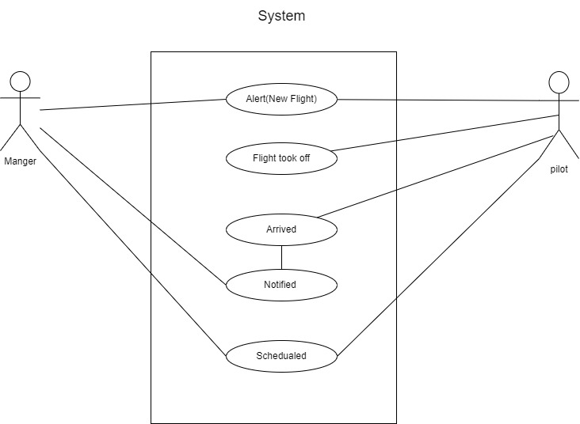

# airline-system

---
Author : Mohammad Attallah

--- 

### Description
This repo involves building a control system for an airline. The system consists of three components: the manager, the pilot, and the system. Each component has specific tasks and responsibilities. 

### System Components

- **Manager**
Alert the pilot and the system when there is a new flight.
 Be notified when a flight has arrived.

- **Pilot**
Alert the system when a flight took off.
Alert the manager and the system when a flight has arrived.
Be notified when a new flight is scheduled.

- **System**
Be notified when a new flight is scheduled.
Be notified when a flight took off.
Be notified when a flight has arrived.


### Output

```JSON

Manager: new flight with ID 'fca81896-9648-5573-b4b4-a56eaf4398de' has been scheduled
Flight {
  event: 'new-flight',
  time: 7/17/2023, 12:02:30 PM
Details: {
  airLine: 'Royal Jordanian Airlines',
  flightID: 'fca81896-9648-5573-b4b4-a56eaf4398de',
  pilot: 'Lura Delgado',
  destination: 'Fawiboli, NV'
} }
Pilot: flight with ID 'fca81896-9648-5573-b4b4-a56eaf4398de' took off
Flight {
  event: 'took-off',
  time: 7/17/2023, 12:02:31 PM
Details: {
  airLine: 'Royal Jordanian Airlines',
  flightID: 'fca81896-9648-5573-b4b4-a56eaf4398de',
  pilot: 'Lura Delgado',
  destination: 'Fawiboli, NV'
} }
Pilot: flight with ID 'fca81896-9648-5573-b4b4-a56eaf4398de' has arrived
Flight {
event: 'arrived',
time: 7/17/2023, 12:02:35 PM
Details: {
  airLine: 'Royal Jordanian Airlines',
  flightID: 'fca81896-9648-5573-b4b4-a56eaf4398de',
  pilot: 'Lura Delgado',
  destination: 'Fawiboli, NV'
} }
Manager: we're greatly thankful for the amazing flight, Lura Delgado
```

### UML
